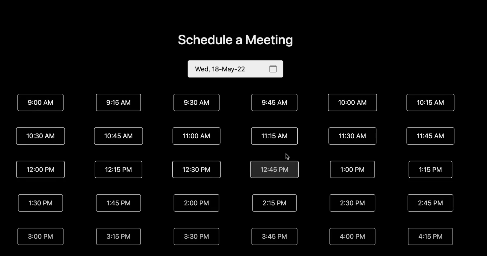

## About
- This app shows the free slots of an executive as per their google calendar so that clients can book meetings, and it has a dashboard for the admin to see all the meetings for an executive.
- On running the app in browser (`/` route), users will get an option to sign in with Google and to give app permission to read/write to their google calender.
- On signin, each user will get their custom calendar link `/calendar/:<user-id>` which can be shared with their clients
- The client can select any date from the dropdown and see all the available meeting slots between 9 A.M. and 5 P.M. for that date. 
- On selecting a slot, the client will be redirected to `/meeting/<user-id>?selectedDate=<date-string>`, where we show the success page and meeting details
- Admins can go to `/admin/meetings` and select employee names from the dropdown to see all the scheduled meeting for that employee

### UI Snapshots
Admin View

Client View

Executive View

## Prerequisites
### Setting up MongoDB Project
- Create a new cluster in [MongoDB](https://www.mongodb.com/) to store user and meeting data. Copy the connection string and add the `MONGO_URI` to the `.env` file

### Setting up project in Google Cloud
- Go to [Google Cloud Console](https://console.cloud.google.com) and create a new project
- Enabling Google API
    - In sidemenu options, select `APIs and Services` -> `Library` -> Search for `Google Calendar API` and enable it
- Setting up the OAuth Screen
    - Inside `APIs and Services` -> `OAuth Consent Screen` -> Select `User Type` (Select `External` for testing) and click on `Create`
    - Now enter all the application details and click `Save and Continue`
    - Inside `Scopes` section -> `Add Scopes` -> Seach for `Google Calendar API` and select the `/auth/calendar` scope. This gives our app access to read and write to user's calendar -> `Save and Continue`
    - If your application is still in `Testing` phase and you selected `External` user type in Step 1, you'll have to provide email ids of all the users who can access your app -> `Save and Continue`
    - Check the app summary and click `Save`
- Generating Credentials
    - Again in `APIs and Services`, select `Credentials` -> `Create Credentials` -> `oAuth Client ID`
    - Select `Application Type` (Web Application), add authorized origin (Use `http://localhost:5000` if you don't have a Domain) and a callback URL where Google will send the response after OAuth (`http://localhost:5000/auth/google/callback` in our case). Also add this as `CALLBACK_URL` in the `.env` file
    - Save you client id and secret as `GOOGLE_CLIENT_ID` and `GOOGLE_CLIENT_SECRET` in the `.env` file

## Setup
- Clone the github repo
- Open terminal, go to the directory and run `npm i`
- Make sure followed all the above steps and added all the variable as specified in the `.env.sample` inside the `.env` file
- Run `npm run dev` which will start a Nodejs server at `localhost:5000`

## Contact
Please feel free to reach out to me at `yashsolanki1709@gmail.com` in case you have any queries.
